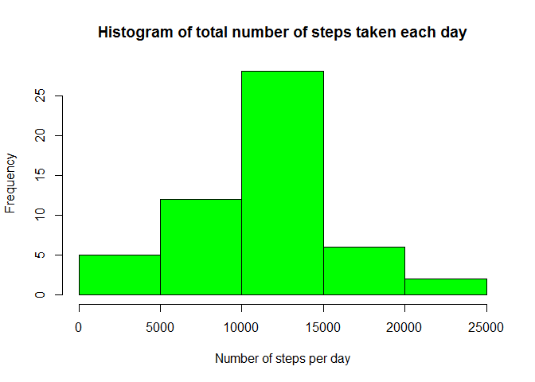
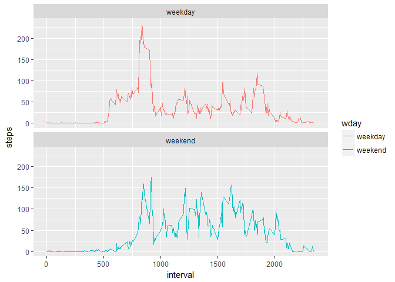

# PA1_template.Rmd


Coursera R Markdown assignment
=================================================================================================================

This assignment makes use of data from a personal activity monitoring device. This device collects data at 5 minute intervals through out the day. The data consists of two months of data from an anonymous individual collected during the months of October and November, 2012 and include the number of steps taken in 5 minute intervals each day.

### Loading/processing the data

 Let's load the relevant packages required for this analysis. 


```r
library(ggplot2)
library(lubridate)
```

Let's load the "Activity Monitoring Data" and read the file. The data is clean and has some missing values as you can see from the output of head.


```r
unzip("repdata%2Fdata%2Factivity.zip", exdir=".", unzip = "internal")
dataFrame <- read.csv("activity.csv")
head(dataFrame)
```

```
##   steps       date interval
## 1    NA 2012-10-01        0
## 2    NA 2012-10-01        5
## 3    NA 2012-10-01       10
## 4    NA 2012-10-01       15
## 5    NA 2012-10-01       20
## 6    NA 2012-10-01       25
```

### Histogram of the total number of steps taken each day

We calculate the total number of steps taken each day and display it by drawing a histogram.


```r
totalSteps <- tapply(dataFrame$steps, dataFrame$date, sum)
hist(totalSteps, xlab="Number of steps per day", main = "Histogram of total number of steps taken each day", col = "green")
```

<!-- -->

### Mean and median number of steps taken each day


```r
meanTotal <- mean(totalSteps, na.rm = TRUE)
meanTotal
```

```
## [1] 10766.19
```

```r
medianTotal <- median(totalSteps, na.rm = TRUE)
medianTotal
```

```
## [1] 10765
```

We see that they are pretty close to each other.

### Time series plot of the average number of steps taken

We create a dataset which stores average steps per interval and create a time series plot using basic plotting system. 


```r
intervalSteps <- tapply(dataFrame$steps,dataFrame$interval, mean, na.rm=TRUE)
plot(intervalSteps, type = "l", lwd=2, col="blue", ylab = "Number of steps", xlab = "Average steps per interval", main = "Time series plot of the average number of steps taken")
```

<!-- -->

### The 5-minute interval that, on average, contains the maximum number of steps


```r
intNum <- names(which.max(intervalSteps)) 
intNum
```

```
## [1] "835"
```

So, the five minute interval that contains the maximum number of steps is Interval # 835. 

### Code to describe and show a strategy for imputing missing data

The total number of missing step values are calculated below:


```r
sum(is.na(dataFrame$steps))
```

```
## [1] 2304
```

In order to impute the missing values we create a copy of the original dataframe.
We create another dataset using the previous 'intervalSteps' dataset but modify it. We include the row names of 'intervalSteps' dataframe as a separate column in the new  dataset 'df' 


```r
copy<- dataFrame
df<-data.frame(interval=(names(intervalSteps)),steps=intervalSteps)
```

We now use a for loop to sequentially replace all missing values in steps with the average number of steps taken in that particular interval and generate a complete dataset. 


```r
for(i in 1:nrow(copy)){
  if (is.na(copy$steps[i]))
  copy$steps[i] <- df$steps[match(copy$interval[i], df$interval)]
}
head(copy)
```

```
##       steps       date interval
## 1 1.7169811 2012-10-01        0
## 2 0.3396226 2012-10-01        5
## 3 0.1320755 2012-10-01       10
## 4 0.1509434 2012-10-01       15
## 5 0.0754717 2012-10-01       20
## 6 2.0943396 2012-10-01       25
```

### Make a histogram of the total number of steps taken each day 

Here is a histogram of the total steps taken per day based on the new complete dataset 


```r
newTotalSteps <- tapply(copy$steps, copy$date, sum)
hist(newTotalSteps, col="red", xlab = "Number of steps taken per day (after imputation)", main = "Histogram of total steps taken per day\n(imputed data)")
```

<!-- -->

### Calculate and report the mean and median total number of steps taken per day. 


```r
newMeanTotalSteps <- mean(newTotalSteps)
newMeanTotalSteps
```

```
## [1] 10766.19
```

```r
newMedianTotalSteps <- median(newTotalSteps)
newMedianTotalSteps
```

```
## [1] 10766.19
```

We see that they are very similar to what we calculated previously by ignoring the missing values. That's because we have replaced the missing values with the average values and hence the deviation from median is almost negligible.

### Create a new factor variable in the dataset with two levels - "weekday" and "weekend" indicating whether a given date is a weekday or weekend day.

We create a new factor variable wday using the lubridate package. 


```r
dataFrame1 <- dataFrame
dataFrame1$wday <- wday(as.Date(dataFrame1$date))
dataFrame1$wday <- ifelse(as.factor(dataFrame1$wday)%in%c(1,7), "weekend",  "weekday")   
dataFrame1$wday <- factor(dataFrame1$wday)
head(dataFrame1)
```

```
##   steps       date interval    wday
## 1    NA 2012-10-01        0 weekday
## 2    NA 2012-10-01        5 weekday
## 3    NA 2012-10-01       10 weekday
## 4    NA 2012-10-01       15 weekday
## 5    NA 2012-10-01       20 weekday
## 6    NA 2012-10-01       25 weekday
```

Then we aggregate the new dataframe by wday (weekday or weekend) and interval and plot it in a multi-panel grid.
We find that on an average subjects take more number of steps on week days in the mornings than on weekends which can be attributed to rushing for work etc. However during the later hours in the afternoon and evenings, average number of steps taken decline significantly on weekdays as opposed to weekends.
  

```r
dataFrame2 <- aggregate(steps~interval+wday, data = dataFrame1, mean)
ggplot(dataFrame2, aes(x=interval, y=steps, col=wday))+geom_line()+facet_wrap(~wday, ncol=1,nrow=2)
```

<!-- -->

